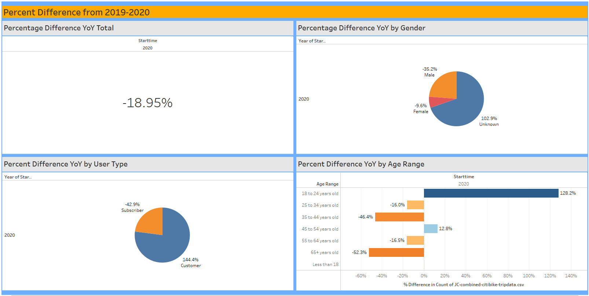
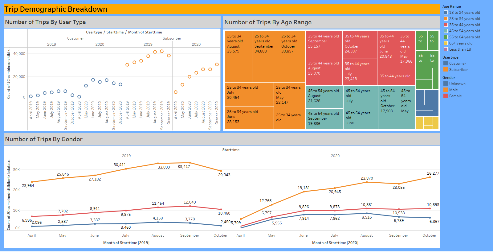
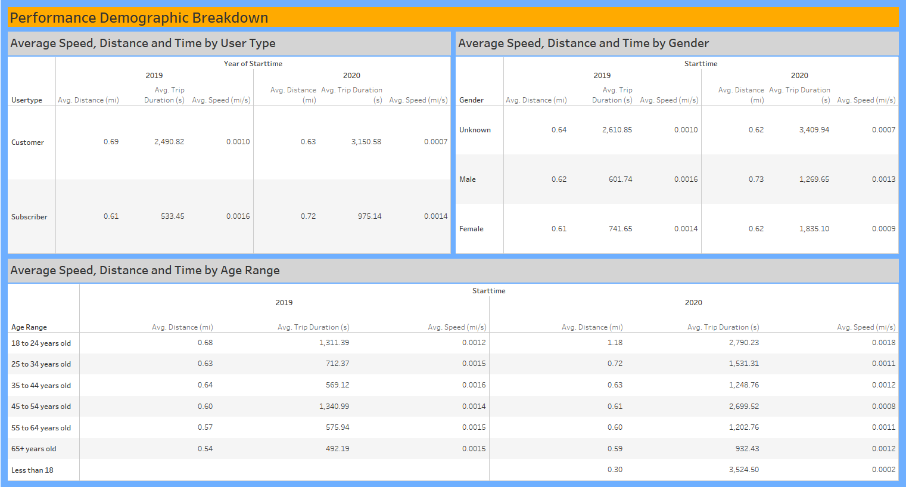
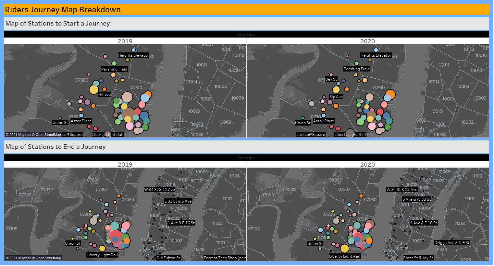
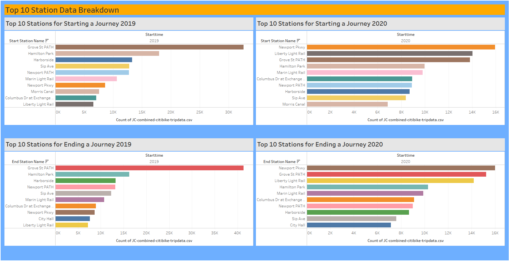
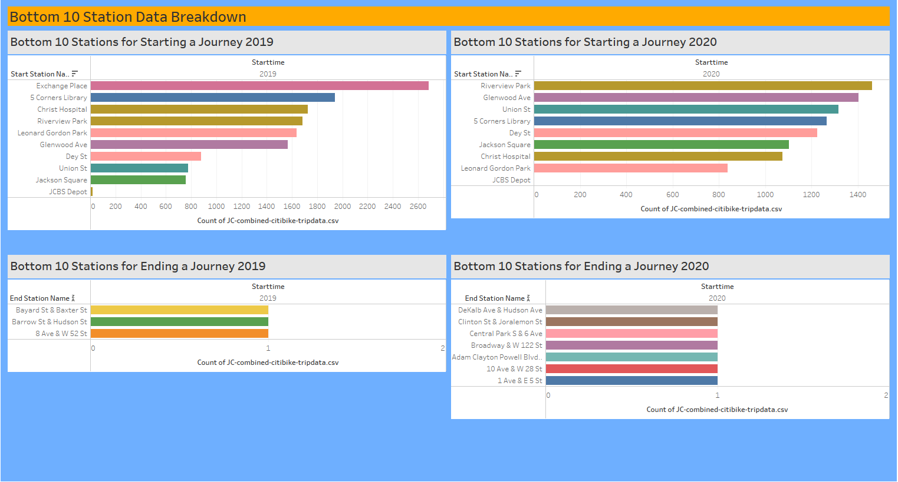

# Tableau Challenge

### Tableau Public Link

https://public.tableau.com/profile/lynell.robinson#!/vizhome/Citi_Bike_Data_Analysis_16174072126400/CitiBikeData

### Overview

Since 2013, the Citi Bike Program has implemented a robust infrastructure for collecting data on the program's utilization. Through the team's efforts, each month bike data is collected, organized, and made public on the Citi Bike Data Webpage.

In 2020, world was hit with a pandemic. Despite the pandemic, it was said that bike ridership had increase The New York Daily News, stated "New Yorkers ditched the subway for good old-fashioned pedal power this summer, cycling a near-record number of times."

-https://www.nydailynews.com/new-york/ny-nyc-cycling-bike-counts-east-river-bridges-20201201-qbqdfh2hs5bfxf7p7b53okrnsi-story.html

Through this storyboard, we will compare data of those using the NY service in Jersey City during prime riding season (April-October) of 2019 and 2020 to see the changes in ridership data.  

 

### Percent Change Analysis

When comparing year to year, the overall number of trips did decrease from 2019 to 2020 by 18.95%. Although there was an overall decrease in trip, there was an increase in short-term customers as well as 18 to 24 year old bike riders. 

Let's take a look at the trips over time to see if there are significant patterns that may require further investigation. 

### Trip Demographic Analysis

The proportion of customers changed with an increase in short-term customers to the annual subscribers from 12.8% to 38.6%.  Although the annual subscribers decrease from year to year, there was continual growth pattern over the course of the year.

 The ridership within the 35-44-year-old age range had the most significant drop 33.5% to 22.1%. Despite the majority of the ages decrease, there was an uptick in ridership for the 18-24-year-olds as well as the 55-64-year-olds. 

 From a gender perspective, males took more trips than females and those that chose not to identify over time. In 2020, there was a more consistent increase in trips over time than in 2019. 

### Performance Demographics Analysis

While there was a decrease in trips from 2019 to 2020, there was an increase in performance overall. 

We can look at performance metrics for the same demographic breakdown. There was an inverse in results from the trip metrics where the annual subscribers outperformed the short-term customers in this case. 

Similar to the trip metrics, the ridership within the 35-44-year-old age range had a drop in performance. 

From a gender perspective, the performances are similar. 

### Station Analysis

The map can help you identify the most popular and least popular stations to start a trip and end a trip. Based on the map, you can see the locations changed from 2019 to 2020 based on the size of markers 

We can dive further to prove this by looking at the top 10 stations to start and end a journey as well as the bottom 10 stations to start and end a journey. 

While most stations did repeat, you will notice that some of the station names did change. 

One other thing to notice is the top places to start and end a journey is disproportionate to the bottom places to start and end a journey. 

